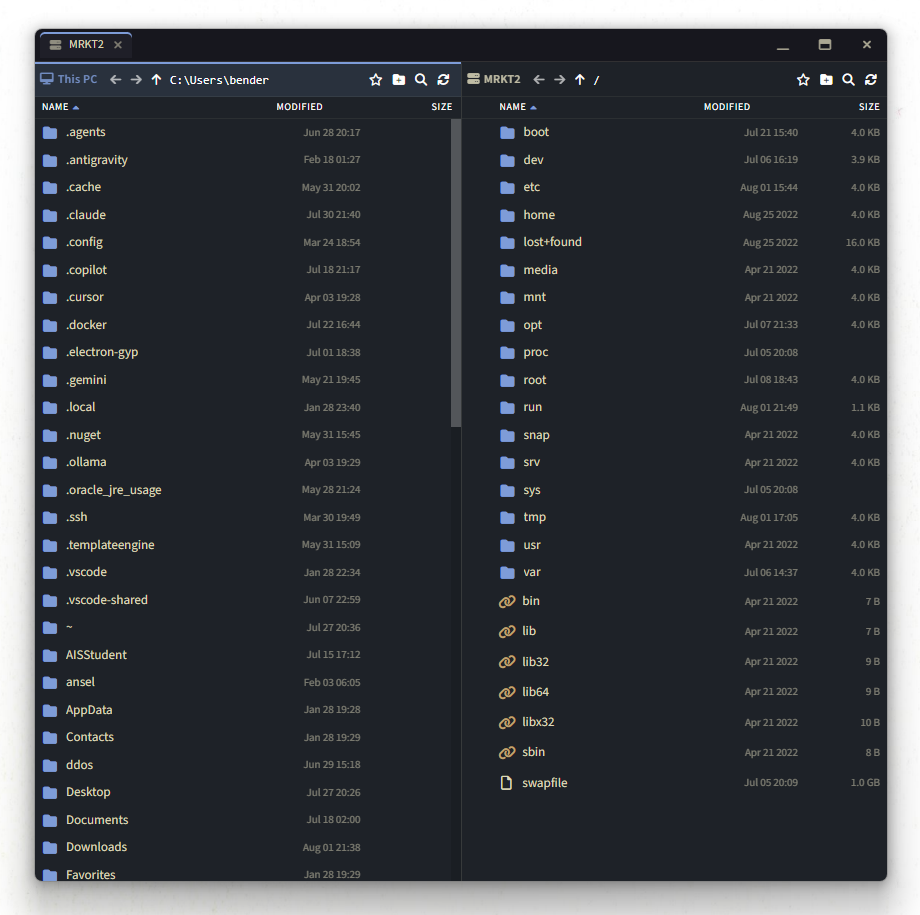

**English** · [Русский](tabby-sftp-plus/README.ru.md)

# Tabby SFTP+

**A dual-pane SFTP file manager for [Tabby](https://github.com/Eugeny/tabby) — WinSCP / MobaXterm-style, right inside your terminal.**

The stock SFTP panel in Tabby is a single-column list that slides out over the
terminal. **SFTP+** replaces that with a proper two-pane file manager: your local
machine on the left, the remote host on the right, drag-and-drop between them, a
live transfer queue, an in-app editor, and a detachable always-on-top window with
tabs — so you can manage files on several servers at once without leaving Tabby.

<!-- Screenshot: hero shot — the floating SFTP+ window, dual pane, local left / remote right.
     Save as: tabby-sftp-plus/docs/screenshots/hero.png -->


---

## Why

- The built-in SFTP drawer only shows the remote side and covers your terminal.
- Copying local ⇄ remote means fighting OS file dialogs.
- No transfer queue, no pause/resume, no editing without a round-trip to disk.

SFTP+ fixes all of that and reuses the **same live SSH session** your terminal is
already connected on — no second login, no extra password prompt.

---

## Features

### Dual-pane browsing
- **Two panes** — local filesystem ⇄ remote host, side by side.
- **Sortable columns** — Name / Modified / Size, folders grouped first.
- **Name filter** — press <kbd>Ctrl</kbd>+<kbd>F</kbd> in a pane to filter as you type.
- **Navigation history** — per-pane back / forward / up buttons.
- **Bookmarks** — star any folder; bookmarks persist between sessions.

### Transfers
- **Direct upload / download** — double-click or the arrow buttons, no OS dialog.
- **Drag-and-drop** — between panes, or onto a folder to drop *into* it. Recursive folders supported.
- **Move within a side** — drag onto a folder (or the ▲ Up button) to move.
- **Transfer queue** — live progress bars, percentage, and per-item **pause / resume / cancel**.
- **Bounded parallelism** — several transfers at once, the rest queue automatically.
- **Overwrite confirmation** — prompts before replacing an existing file.

### Editing — no temp files
- **Built-in editor** — right-click any file → *Edit* to open it in an in-app editor (works for both local and remote files).
- **Syntax highlighting** — lightweight, dependency-free.
- **Save with <kbd>Ctrl</kbd>+<kbd>S</kbd>** — remote saves are written atomically; a dirty-dot marks unsaved changes.

### Right-click menu
- New folder, rename, delete (recursive) — on both panes.
- **Show in Explorer** and **Open with default app** for local items.

### Windowing
- **Open as a tab** inside Tabby, **or** as a **detachable always-on-top window**.
- **Frameless, themed title bar** that matches Tabby's look.
- **Multiple servers, one window** — every SFTP+ you open becomes a **tab** in the
  same window; opening a server that's already open just focuses its tab.
- Fully **theme-aware** (adapts to light and dark Tabby themes).

---

## Screenshots

<!-- Replace each placeholder below with a real capture. Folder: tabby-sftp-plus/docs/screenshots/ -->

**Dual-pane, local ⇄ remote**
<!-- Screenshot: the SFTP+ tab or window with both panes populated. Save as: tabby-sftp-plus/docs/screenshots/dual-pane.png -->


**Tabs — several servers in one window**
<!-- Screenshot: the floating window with 2+ tabs in the title bar. Save as: tabby-sftp-plus/docs/screenshots/tabs.png -->


**Transfer queue with progress**
<!-- Screenshot: bottom transfer queue mid-transfer, progress bars + pause/cancel buttons visible. Save as: tabby-sftp-plus/docs/screenshots/transfers.png -->


**Built-in editor with syntax highlighting**
<!-- Screenshot: the in-app editor overlay open on a remote file. Save as: tabby-sftp-plus/docs/screenshots/editor.png -->


**Right-click context menu**
<!-- Screenshot: context menu open over a file/folder. Save as: tabby-sftp-plus/docs/screenshots/context-menu.png -->


---

## Install & run

SFTP+ ships as a **built-in plugin inside this Tabby fork**. Build the fork and
run it like normal Tabby — the plugin is already registered.

```bash
# from the repository root
yarn install      # installs dependencies (builds native modules)
yarn build        # compiles Tabby + all built-in plugins, incl. SFTP+
yarn start        # launches Tabby in dev mode
```

> **Native modules / Windows:** building the full app requires the same toolchain
> as upstream Tabby (Node, Yarn, and a C++ toolchain for native modules). See the
> upstream [Tabby build guide](https://github.com/Eugeny/tabby#building) if you hit
> native-module errors.

To iterate on just the plugin while Tabby is running, rebuild only its bundle and
reload the renderer with <kbd>Ctrl</kbd>+<kbd>R</kbd>:

```bash
cd tabby-sftp-plus
yarn build
```

---

## Usage

1. Open an **SSH** tab and connect to a host.
2. Click the **SFTP+** button in the toolbar.
   - **Left-click** → opens the floating window.
   - **Submenu** → choose *Open as floating window* or *Open as tab*.
3. Browse, transfer, and edit. Open SFTP+ on other SSH tabs to add more **tabs**
   to the same window.

**Handy keys**

| Key | Action |
|-----|--------|
| <kbd>Ctrl</kbd>+<kbd>F</kbd> | Filter the focused pane by name |
| <kbd>Ctrl</kbd>+<kbd>S</kbd> | Save in the built-in editor |
| Double-click | Enter folder / transfer file |
| Drag | Transfer between panes, or move within a pane |

---

## How it's built

SFTP+ is a plugin built on Tabby's **public `tabby-ssh` API**
(`SSHSession.openSFTP()` → `SFTPSession`), so the file-browsing logic lives
entirely in the `tabby-sftp-plus/` folder and reuses your existing SSH session.

The detachable window is a real, always-on-top OS window that **shares the
renderer's JS context**, so the *same* live SFTP session is reused with no IPC
proxy. Because a plugin cannot alter the main process, this fork carries two small
core changes:

| File | Change | Needed for |
|------|--------|-----------|
| `scripts/vars.mjs` | registers `tabby-sftp-plus` as a built-in plugin | bundling the plugin |
| `app/lib/window.ts` | allows the SFTP+ popup in `setWindowOpenHandler` and makes it frameless (`frame: false`) | the detachable window + custom title bar |

Everything else is contained in the `tabby-sftp-plus/` plugin folder. If you only
want the **tab** mode, the plugin works without the `window.ts` change (you just
lose the detachable window).

---

## Credits & license

This is a fork of [Tabby](https://github.com/Eugeny/tabby) by Eugeny — a fantastic,
extensible terminal — that adds the SFTP+ experience on top of it. All upstream
Tabby documentation lives in the [upstream repository](https://github.com/Eugeny/tabby).

Licensed under the **MIT License**, same as upstream Tabby (see [`LICENSE`](LICENSE)).
